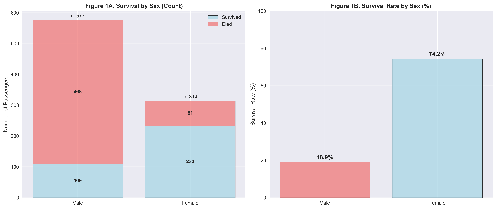
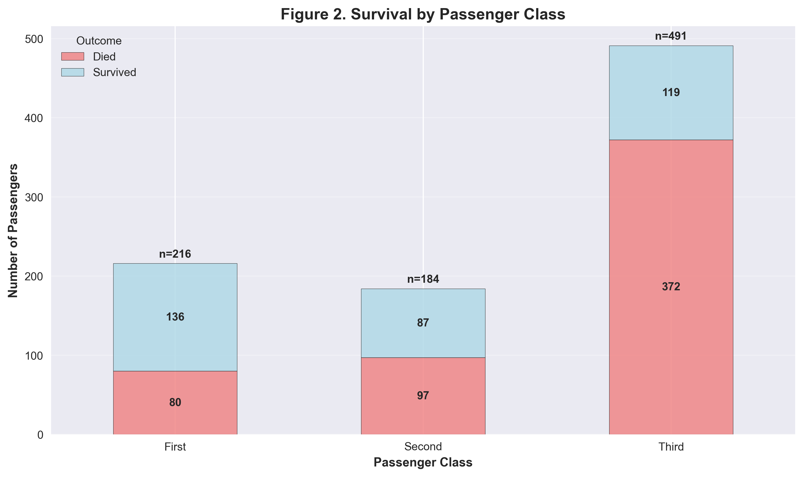
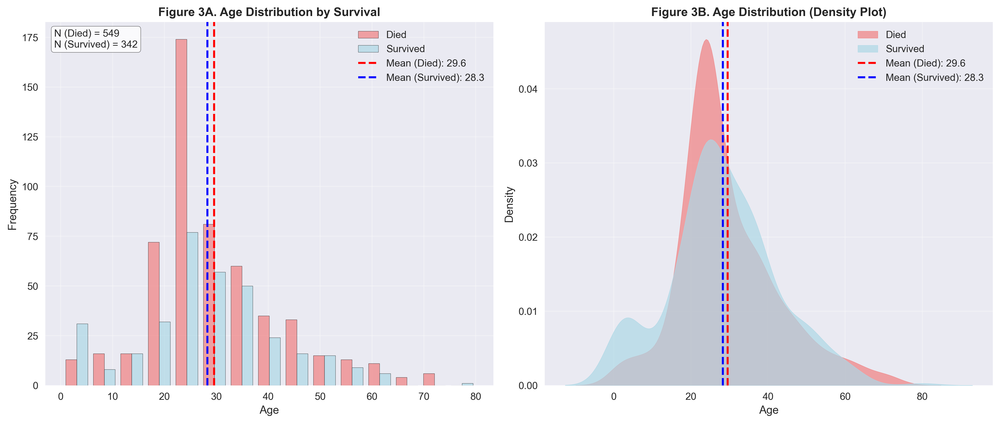

```markdown
# Titanic Passenger Survival Analysis

## Project Objectives
1. Conduct exploratory data analysis (EDA) to identify factors influencing passenger survival.
2. Create visualizations to illustrate key relationships (gender, class, age, ticket price).
3. Formulate conclusions about the most significant survival factors.

## Used Libraries
- `pandas` for data processing
- `seaborn` and `matplotlib` for visualization
- `numpy` for mathematical operations

## Analysis Stages
1. **Data Preparation**:
   - Load the `titanic` dataset from the Seaborn library.
   - Handle missing values:
     - Fill age (`Age`) gaps with class-specific medians.
     - Fill embarkation port (`Embarked`) gaps with the mode.
   - Log-transform ticket price (`Fare`) to reduce variance.
   - Encode gender (`Sex`) as numerical values (male=0, female=1).

2. **Statistical Analysis**:
   - Calculate descriptive statistics (mean, median, percentages).
   - Group data by categorical features (gender, class, age).

3. **Visualization**:
   - Figure 1: Survival by gender (absolute values and percentages).
   - Figure 2: Survival by passenger class (stacked bar chart).
   - Figure 3: Age distribution among survivors and non-survivors (histogram and density plot).

## Key Findings
1. **Gender**:
   - Women had significantly higher survival rates (~74%) compared to men (~19%).
   - Gender was one of the most critical survival factors.

2. **Passenger Class**:
   - First-class passengers had the highest survival rate (~63%).
   - Survival rates decreased with lower classes: ~47% for second class and ~24% for third class.
   - Class directly correlated with access to lifeboats and cabin locations.

3. **Age**:
   - Younger passengers (children) had higher survival rates.
   - Survivors had a lower average age than non-survivors.
   - Age correlated with class: children were more likely to travel in first class.

4. **Ticket Price**:
   - Higher ticket prices (first class) were associated with better survival chances.
   - Log-transformation revealed right-skewed ticket price distribution.

## Visualizations
  


  


  


## Summary
1. **Most Significant Survival Factors**:
   - Gender (women survived more frequently).
   - Passenger class (first class provided better chances).
   - Age (children had advantages).

2. **Analysis Limitations**:
   - Lack of data on marital status and family size.
   - No information on cabin locations or evacuation routes.

3. **Recommendations for Further Research**:
   - Expand analysis with additional features (e.g., family status).
   - Conduct regression analysis to quantify factor impacts.

## Project Structure
```
titanic_analysis/
├── README.md
├── figure1_survival_by_sex.png
├── figure2_survival_by_pclass.png
├── figure3_age_distribution.png
└── Ex1.py
```

## Conclusion
This project demonstrates how structured data analysis can identify key survival factors. Results confirm the historical hypothesis of prioritizing women and first-class passengers during evacuation, aligning with events of April 15, 1912.
```
